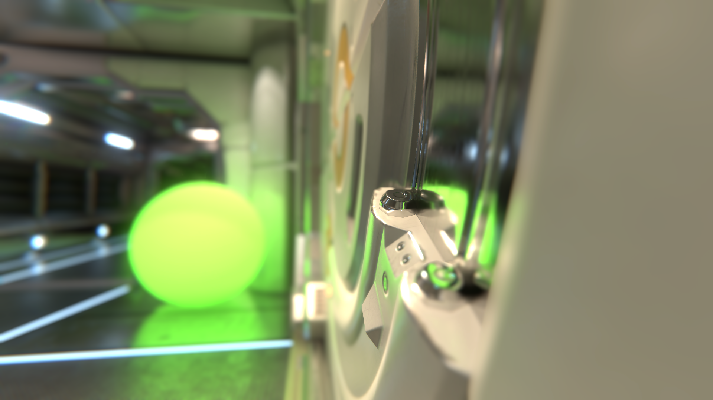
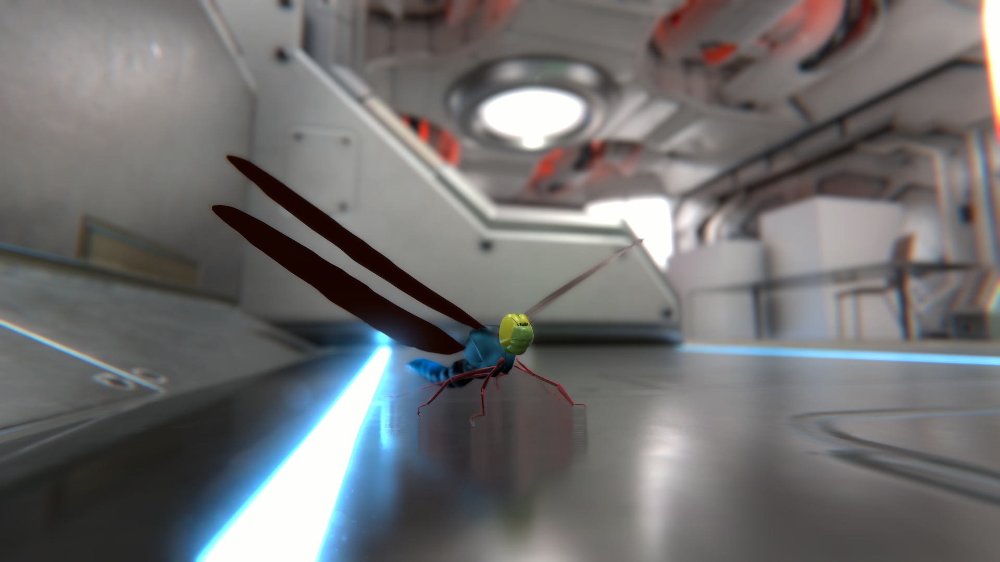
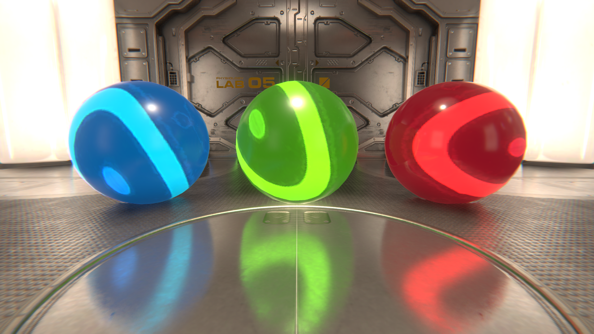
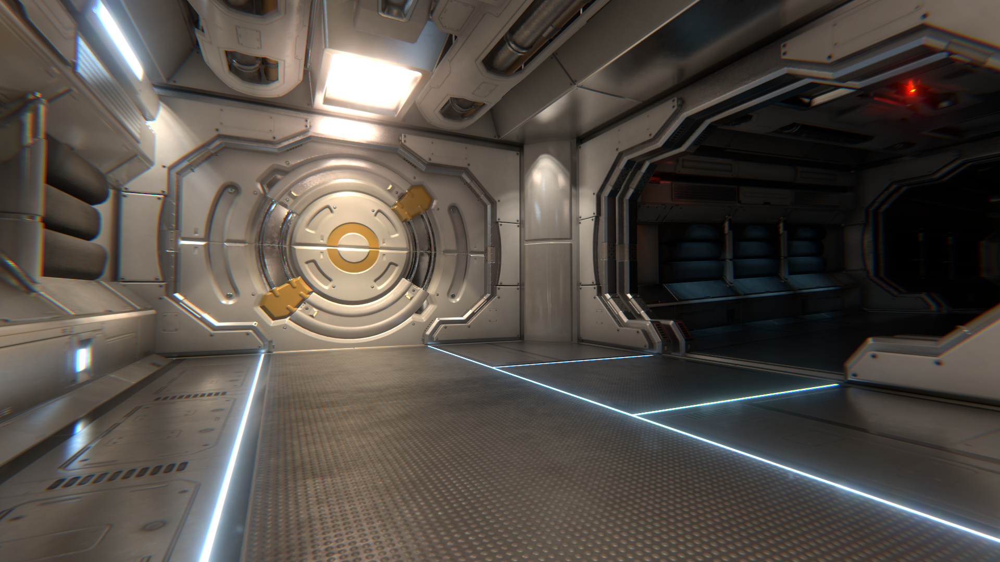

# Cat-Post Processing Effects for Unity 2017.2
High Quality Post-processing effects for Unity. It is compatible with Unity 5.5, Unity 5.6, Unity 2017.1 and Unity 2017.2

Downloads:  
[Current Version][Package_Newest_LINK] <--  
[Developement Version][Branch_Develop_LINK]

 <table style="width:100%;border-spacing:0px">
  <tr style="padding:0px">
    <td colspan="2" style="padding:0px">  </td>
  </tr>
  
  <tr style="padding:0px">
    <td style="padding:0px">  </td>
    <td style="padding:0px">  </td>
  </tr style="padding:0px">
  
  <tr style="padding:0px">
    <td colspan="2" style="padding:0px">  </td>
  </tr>
</table>

The main goal is to create high quality post-processing effects with only a small performance impact. Tested with Unity 2017.2.0f3.

There are currently 7 different post-processing effects included:
- Ambient Occlusion ([AO][AO_ANCHOR])
- Stochastic Screen Space Reflections ([SSR][SSR_ANCHOR]), Importance Sampled with contact hardening, specular elongation and retro reflections 
- Depth of Field ([DoF][DoF_ANCHOR])
- Chromatic Aberration ([CA][CA_ANCHOR])
- [Bloom][Bloom_ANCHOR] Effect with energy conservation
- Temporal Anti-Alialising ([TAA][TAA_ANCHOR])
- Color Grading ([CG][ColorGrading_ANCHOR])

## Install Intructions
Download the [newest version here][Package_Newest_LINK], and import the Package via the menu `Assets`&rarr;`Import Package`&rarr;`Custom Package...`.

## Usage
> For maximum awesomeness we recommend that you work in **Linear + HDR**. Some effects will look wired in Gamma or without LDR. Using the **Deferred rendering path** is also recommended (and required for some effects like [Screen Space Reflections][SSR_ANCHOR] and [Ambient Occlusion][AO_ANCHOR]).

To add an effect to your camera, either
- Use the menu `Component`&rarr;`Cat`&rarr;`Post Processing`. Or
- Use the `Add Component` button in the inspector. `Add Component`&rarr;`Cat`&rarr;`Post Processing`.

## Ambient Occlusion
![AmbientOcclusionGUI_IMG][AmbientOcclusionGUI_IMG]
- **Intensity:** The intensity of the ambient occlusion.
- **Sample Count:** How many samples should be taken? Try to keep it small.
- **Radius:** The search radius. Try to keep it small, too.
- **Debug On:** Visualizes the generated Ambient Occlusion.

## Screen Space Reflections
For best Results use this effect together with Temporal Anti-Alialising.

Performance comparison, 2Kx2K resolution: | ms / frame
--- | ---
No SSR: | 10.5 - 12.3 ms
SSR from Unitys [Post Processing Stack](https://github.com/Unity-Technologies/PostProcessing): | 23.2 - 24.0 ms
[SSSR by cCharkes](https://github.com/cCharkes/StochasticScreenSpaceReflection): | 21.8 - 22.3 ms
Cat SSR: | 17.0 - 17.8 ms

![ScreenSpaceReflectionsGUI_IMG][ScreenSpaceReflectionsGUI_IMG]

RayTracing
- **Ray Trace Resol.:** The Resolution of the generated hit texture. _High Performance Impact!_
- **Step Count:** The maximum amount of steps the ray tracer will take. _High Performance Impact!_
- **Min Pixel Stride:** The minimum size of a step im pixels.
- **Max Pixel Stride:** The maximum size of a step im pixels.
- **Cull Back Faces:** If selected rays towards camera are ignored. Can Increase performance a lot in indoor scenes
- **Max Refl. Distance:** The radius around the Player (in meters) in which reflections are calculated. mosly usfull in large outdoor scenes

Reflections
- **Reflection Resol.:** The Resolution of the generated reflection texture. _Medium Performance Impact!_
- **Intensity:** The intensity of the reflections.
- **Distance Fade:** Controls how soon reflections are faded out, based on distance to the camera.
- **Ray Length Fade:** Controls how soon reflections are faded out, based on length of ray.
- **Screen Edge Fade:** Controls how soon reflections are faded out, based on distance from the border of the screen.
- **Retro Reflections:** Controls whether retro-reflections are used or not. Very low, if any performance impact.

Importance sampling
- **Sample Count:** Amount of samples per pixel (usually `4`). _Medium Performance Impact!_
- **Bias (Spread):** Controls how far the samples are spread out. Physically correct is a value of `1`, but that can lead to artifacts
- **Use Mip Map:** Mip Maps have a surprisingly low impact on performance. They can de-noise the Reflections substantially, but the can also lead to some subtle artifacts.

Temporal
- **Use Temporal:** Temporally de-noises the importance sampled reflections. But this can currently lead to strong artifacts when an object moves in front of a highly reflective background.
- **Response:** TBD.
- **Tolerance Margin:** TBD.

Debugging
- **Debug On:** TBD.
- **Debug Mode:** TBD.
- **Mip Level For Debug:** TBD.

## Depth of Field
![DepthOfFieldGUI_IMG][DepthOfFieldGUI_IMG]
- **f-Stop f/n:** Also: f-number. Describes the size of the aperture. A smaller value means a larger aperture and you get a smaller depth of field. See [Wikipedia][fNumberWikipedia_LINK].
- **Focus Distance:** The Distance of object in focus (*S1*). Not to be confused with the [focal length][FocalLengthWikipedia_LINK] *f*.
- **Radius:** a value of `5` semms to work pretty well.
- **Debug On:** Shows the Focus Distance in red .

## Chromatic Aberration
![ChromaticAberrationGUI_IMG][ChromaticAberrationGUI_IMG]

## Bloom
![BloomGUI_IMG][BloomGUI_IMG]
- **Intensity:** The intensity of the bloom.
- **Dirt Intensity:** Only effective when a Dirt Texture is selected  
- **Dirt Texture:** The dirt on the lense. (RGB)
- **Min Luminance:** Minimum luminance required for the bloom to appear.
- **Knee Strength:** 
- **Debug On:** Visualizes the Bloom only.

## Temporal Anti-Alialising
![TemporalAntiAlialisingGUI_IMG][TemporalAntiAlialisingGUI_IMG]
- **Sharpness:** Artificially sharpens the image. High values can look cheap.
- **Velocity Scale:** Controls how sensitive it reacts when pixels move along the screen.
- **Response:** Controls how fast a pixel responds to a change of color.
- **Tolerance Margin:** 
- **Jitter Matrix:** What jitter sequence should be used to shake the camera. (Halton Sequence recomended)
- **Halton Seq. Length:** The length of the Halton Sequence if selected.

## Color Grading
![ColorGradingGUI_IMG][ColorGradingGUI_IMG]
Color Grading
- **Exposure:** Artificially darkens / brightens the image (post exposure).
- **Contrast:** Changes the contrast without altering the saturation.
- **Saturation:** Changes the colorfullness of the image.

Color Correction
- **Temperature:** Blue / Orange.
- **Tint:** Lime Green / Pink.

Curves
- **BlackPoint:** Moves the black point of the image.
- **MidPoint:** Moves the mid grays of the image.
- **WhitePoint:** Moves the white point of the image.
- **Shadows:** Strengthens / weakens the shadows.
- **Highlights:** Strengthens / weakens the highlights.

![Main Img 2][DragonFly_IMG]

[Download][Package_Newest_LINK] Cat-Post Processing Effects for Unity

[coloredBalls_IMG]:              Media/coloredBalls.png               "Most Effects in action 1"
[ElevatorDoor_IMG]:              Media/ElevatorDoor.png               "Most Effects in action 2"
[ElevatorDoorDetail_IMG]:        Media/ElevatorDoorDetail.png         "Most Effects in action 3"
[DragonFly_IMG]:                 Media/DragonFly3.png                 "Most Effects in action 4"
[AmbientOcclusionGUI_IMG]:       Media/CatAOGUI.png                   "Ambient Occlusion GUI"
[ScreenSpaceReflectionsGUI_IMG]: Media/CatSSRGUI.png                  "Screen Space Reflections GUI"
[DepthOfFieldGUI_IMG]:           Media/CatDoFGUI.png                  "Depth of Field GUI"
[ChromaticAberrationGUI_IMG]:    Media/CatChromaticAberrationGUI.png  "Chromatic Aberration GUI"
[BloomGUI_IMG]:                  Media/CatBloomGUI.png                "Bloom Effect GUI"
[TemporalAntiAlialisingGUI_IMG]: Media/CatAAGUI.png                   "Temporal Anti-Alialising GUI"
[ColorGradingGUI_IMG]:           Media/CatColorGradingGUI.png          "Color Grading GUI"

[Install_ANCHOR]:                #install-intructions
[Usage_ANCHOR]:                  #usage
[AO_ANCHOR]:                     #ambient-occlusion
[SSR_ANCHOR]:                    #screen-space-reflections
[CA_ANCHOR]:                     #chromatic-aberration
[DoF_ANCHOR]:                    #depth-of-field
[TAA_ANCHOR]:                    #temporal-anti-alialising
[Bloom_ANCHOR]:                  #bloom
[ColorGrading_ANCHOR]:           #color-grading

[Releases_LINK]:                 https://github.com/JoachimCoenen/Cat-PostProcessing/releases "Cat-PostProcessing/releases"
[Package_Newest_LINK]:           https://github.com/JoachimCoenen/Cat-PostProcessing/releases/download/v0.4.1-alpha/Cat-Post.Processing.v0.4.1.unitypackage  "Cat-Post Processing v0.4.1-alpha - Source Code"
[Branch_Develop_LINK]:           https://github.com/JoachimCoenen/Cat-PostProcessing/tree/develop "develop branch"

[fNumberWikipedia_LINK]:         https://en.wikipedia.org/wiki/F-number                       "f-number - Wikipedia"
[FocalLengthWikipedia_LINK]:     https://en.wikipedia.org/wiki/Focal_length                   "Focal length - Wikipedia"

