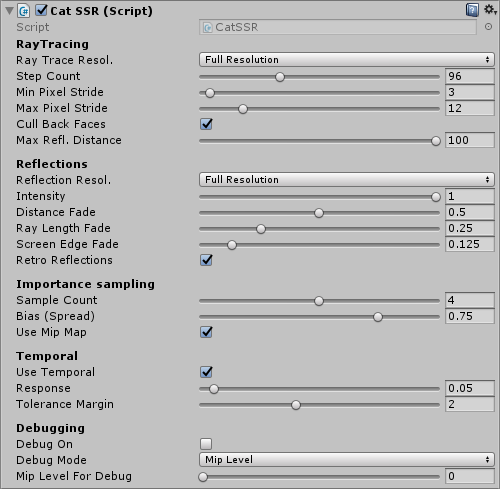

# Cat-PostProcessing for Unity
Various post-processing effects for Unity

The main goal is to create fast and efficient post-processing effects for Unity.

There are currently 2 different post-processing effects included:
- Screen Space Reflections (SSR) with retro reflections
- Temporal Anti-Alialising (TAA)

## Screen Space Reflections

## Temporal Anti-Alialising

## Install Intructions
Simply put the "Cat" folder into your "Assets" folder.
